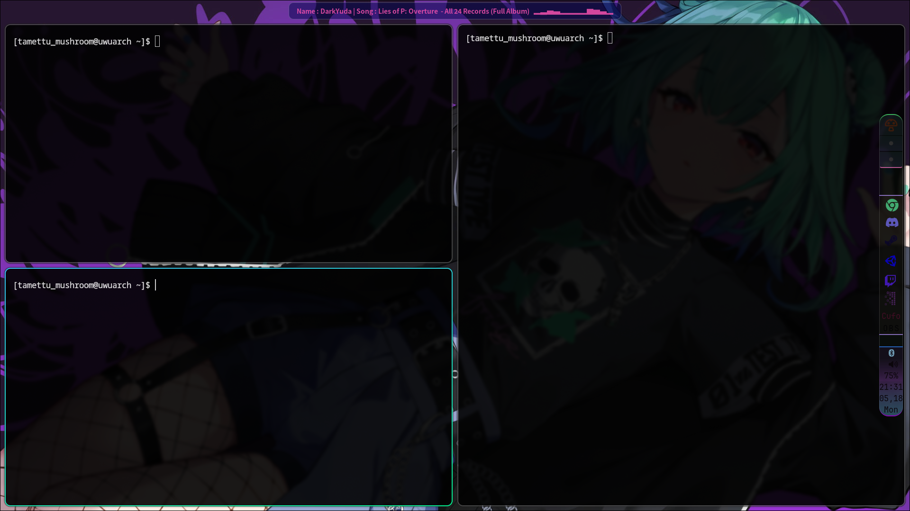

# 🪐 My Arch Linux + Hyprland Dotfiles & Tools

My personal rice and utility repository for an elegant, high-performance Arch Linux environment.

## 📁 Repository Structure
* **`fontconfig/`** - System font rendering and fallback rules.
* **`hypr/`** - Hyprland window manager configurations, hotkeys, and workspace rules.
* **`kitty/`** - GPU-accelerated terminal setup and styles.
* **`show_playing_music_app/`** - Lightweight custom media tracking tool written in Rust.
* **`waybar/`** - Status bar layouts, including Cava visualizer integration.

## 🚀 Quick Start
```bash
# 1. Install core dependencies
yay -S hyprland kitty waybar dolphin hyprpaper fontconfig hyprshot wofi cliphist playerctl-git

# 2. Link configs
cp -r fontconfig hypr kitty waybar ~/.config/

# 3. Build the Rust helper
cd show_playing_music_app && cargo build --release
```

## 📸 Desktop Preview



* **Window Manager:** Hyprland (Tiling)
* **Bar:** Waybar
* **Terminal:** Kitty